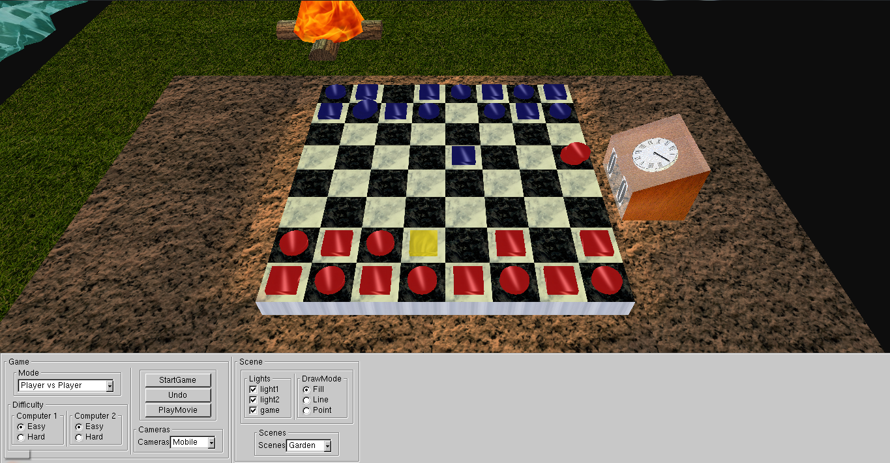
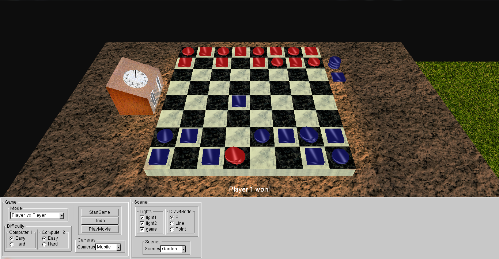
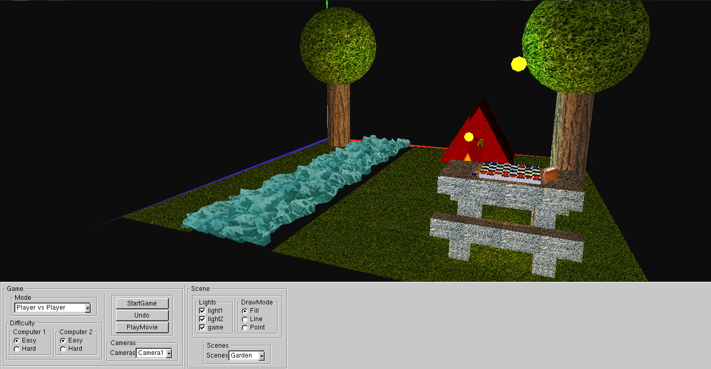
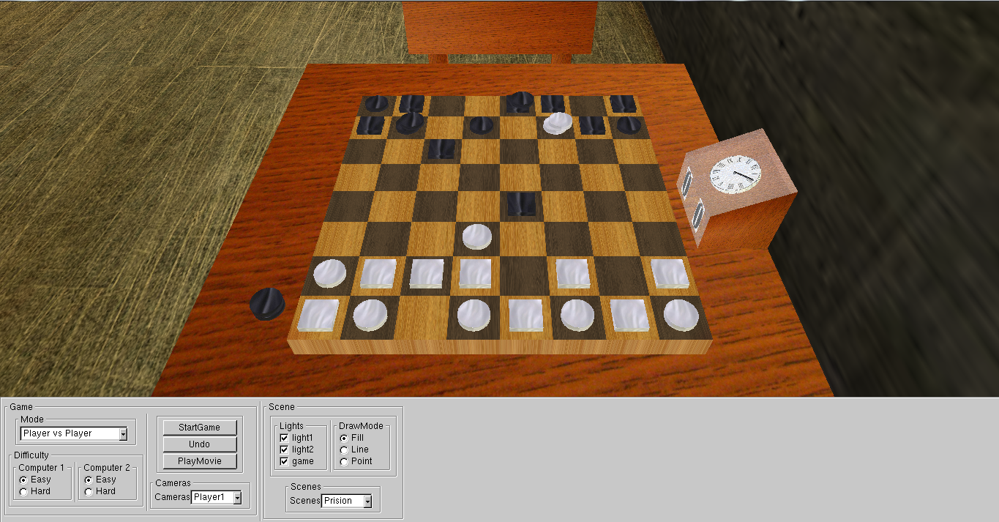
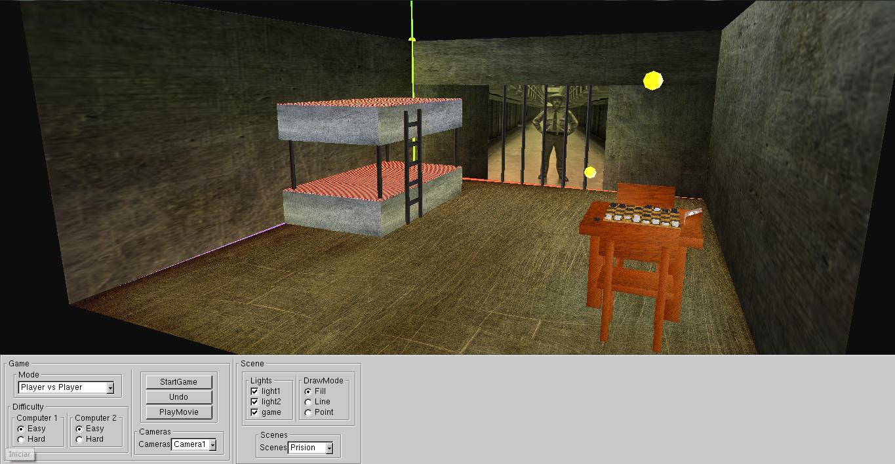

Gounki 3D
====
Gounki is an abstract strategy game in which pieces can combine and disperse to affect their movement possibilities. Played on an eight-by-eight square grid, the goal is to move one of your own pieces off the opposite end of the board while preventing your opponent from doing the same. 
The game's rules can be found [here](gounki.pdf).
Context
------------------
It was a project done for LAIG and PLOG, two subjects of the 3rd year of MIEIC. In PLOG the game's logic was implemented using prolog. In LAIG it was done all the 3D graphics and interface. This project was the third in LAIG, so it was taken advantage of the Scene Graph engine implemented in the previous projects.


To run:
-------
```
1. Run bin/prolog.exe 
2. Run bin/CGFexample.exe 
3. Click StartGame 
```

You've to run two executables because they are different programs communicating through sockets. The first one has the game's logic and the second has the graphics and interface.

SnapShots:
-------

### Scene 1
<center>



</center>
### Scene 2
<center>


</center>
